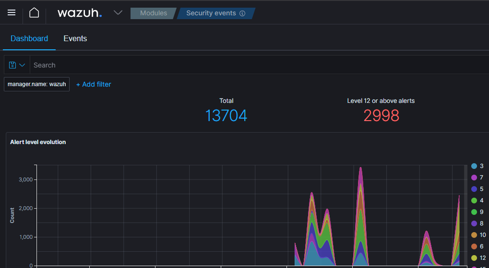

# SOC Simulator

A home lab project I built to train myself in SOC analyst work. It runs real attacks on a Windows VM, pulls the alerts into a dashboard I built, and grades my incident report with AI at the end. 250 attack scenarios, 6 false alarm bundles, and a 282-action background noise simulator to make the alert feed look like a real one. Wazuh runs the detection in the background.



I built this to get hands-on experience with the kind of work a SOC analyst does day to day. Reading alerts, figuring out what happened, telling real attacks from false alarms, and writing it all up in a report.

## Screenshots

*Main dashboard*  


*Starting a simulation*


*Writing the report*


## What it does

I press Start Simulation. The backend rolls a dice. 75% of the time it's a real attack, 25% it's a false alarm. I don't know which one I got.

If it's a real attack, it picks one of 250 scenarios I wrote (each one inspired by a real APT group) and runs the techniques on the Windows VM through PowerShell Remoting. Stuff like credential dumping, lateral movement attempts, scheduled task persistence, registry tricks, etc.

If it's a false alarm, it runs actual benign activity that looks suspicious. Things like an IT admin doing a network audit, Windows Update kicking off, a dev pulling stuff from GitHub. The point is I can't just look at a quiet feed and say "false alarm" because the feed isn't quiet. I have to actually rule out an attack with evidence.

While all this is happening there's also a background noise script running on the VM that simulates a normal user doing normal stuff. Browsing files, checking emails, opening apps, DNS lookups, all of it. So the alert feed is messy like a real one would be.

When the simulation finishes, the alerts get frozen into a snapshot.

*Alerts*


*Extend an alert to see details*


I read through them, write my report, submit it. Claude grades me on 5 things out of 5 each (techniques, tactics, timeline, severity, recommendations) and gives me written feedback on what I missed.

*A good report*


*A bad report*


## Architecture
```
┌──────────────────────┐
│   Host Machine       │
│   Flask + Dashboard  │
└──────────┬───────────┘
           │ WinRM (runs attacks)
           ▼
┌──────────────────────┐         ┌────────────────────┐
│   Windows 11 VM      │────────▶│   Wazuh Server     │
│   Sysmon + Agent     │  agent  │   SIEM + Alerts    │
│   Atomic Red Team    │ reports │   OpenSearch       │
└──────────────────────┘         └─────────┬──────────┘
                                           │
                                           │ alerts pulled
                                           ▼
                                 ┌────────────────────┐
                                 │   Flask scoring    │
                                 │   → Claude API     │
                                 └────────────────────┘
```
The setup is three VMs on a host-only network plus the host machine running Flask:

- **Host machine** runs the Flask app and the dashboard
- **Wazuh server** (Ubuntu) handles the SIEM, dashboard, and alert storage
- **Windows 11 VM** is the attack target, has Sysmon and the Wazuh agent
- **Kali VM** is sitting on the network for future stuff (network-based attacks)

The Flask app talks to the Windows VM through WinRM to fire off attacks, pulls alerts from Wazuh's OpenSearch backend, and calls the Claude API for scoring.

## Tech stack

- Python 3.13 + Flask for the backend
- pypsrp for PowerShell Remoting to the Windows VM
- Wazuh SIEM with Sysmon (Olaf Hartong's modular config) on the agent
- Atomic Red Team for the attack techniques
- Claude API for grading reports
- VirtualBox for the lab
- Vanilla HTML/CSS/JS for the frontend (no framework, single page)

## The scenarios

I wrote 250 attack scenarios as YAML files. Each one has a name, an APT group it's inspired by, a difficulty, and a list of steps. Each step maps to a real ATT&CK technique and uses an Atomic Red Team GUID so the actual command that runs is a real known technique.

Examples of what's in there:
- Credential dumping with Mimikatz patterns
- Scheduled task persistence
- WMI lateral movement
- Registry run key persistence
- Encoded PowerShell command execution
- DLL search order hijacking
- Token impersonation attempts

The scenarios run with 15 second sleeps between each step so they look like a real attacker working through their playbook, not a script firing everything at once.

## The false alarm bundles

There are 6 of these and they run real PowerShell on the VM:

| Bundle | What it does |
|--------|--------------|
| IT Admin Network Audit | Network enumeration commands, port checks, ARP table |
| Software Update Activity | Windows Update API calls, registry reads under update keys |
| Developer Environment Setup | Web requests to GitHub and PyPI, DNS lookups, file searches |
| Scheduled Maintenance Task | Creates a scheduled task, runs it, deletes it |
| Antivirus Full System Scan | Defender scan + mass file system access |
| Helpdesk Remote Support | whoami, systeminfo, ipconfig, process listing, event log reads |

Every one of these will throw alerts that look like an attack at first glance. The point is to make me actually read them.

I will be adding way more in the future.

## The background noise simulator

A separate PowerShell script (UserNoise) runs on the VM as a scheduled task at logon. It simulates a real user doing real things so the alert feed isn't dead silent before the attack starts. 282 different actions across browsing files, reading event logs, DNS lookups to 36 real domains, registry reads, network checks, scheduled task queries, all the normal stuff a Windows user generates.

Each action runs in its own isolated PowerShell subprocess via a temp script file. I use `-File` instead of `-EncodedCommand` because encoded commands trigger AV rules. Temp files get cleaned up immediately after each action. Random 25-35 second intervals so the noise pattern doesn't look scripted.

Without this, false alarms would be too easy to spot. With it, I have to actually read the alerts to know what's real.

## How the scoring works

When I submit my report it goes to Claude along with the answer key (what actually ran on the VM). Claude isn't guessing here. It already knows exactly what happened because the simulator tells it. So the grading is based on real facts, not Claude trying to figure things out on its own.
- **Technique identification** - did I name the right ATT&CK techniques and back it up with specific alerts
- **Tactic identification** - did I map them to the right tactic IDs
- **Timeline** - did I put the events in the right order with timestamps
- **Severity** - did I assess the impact correctly
- **Recommendations** - did I give specific containment steps that actually make sense

There are caps built in so I can't game it. Naming techniques without citing alert evidence caps me at 3/5. Generic recommendations cap at 2/5. Reports under 50 words cap at 2/5 on everything. Zero recommendations on a false alarm = 1/5.

It's harsh on purpose. I wanted feedback that would actually push me to write better reports, not pat me on the back for vague answers. For example: A vague report got 10/25. The same scenario investigated properly with timestamps and command-line evidence got 25/25. The system rewards real analyst work.

## Setup notes

The Wazuh agent and Sysmon are doing all the heavy lifting on the detection side. I'm using Olaf Hartong's sysmon-modular config which is a really solid setup. Sysmon catches the process creation, network connection, and registry stuff, Wazuh's rules tag it with ATT&CK techniques, and that's what shows up in the alert feed.

Each VM has two network adapters. One is host-only so the VMs can talk to each other and to the Flask app on my host machine, and the other is NAT so they can reach the internet for updates and agent traffic. Atomic Red Team is installed locally on the Windows VM so the attacks run from files already on the machine, no pulling stuff down mid-simulation.

## What I learned building this

A lot. Here's the short version:

- How Sysmon, Wazuh, and the ATT&CK framework actually fit together in practice
- How noisy a real alert feed is and how to filter signal from noise
- Why time correlation across events matters more than any single alert
- How attackers chain techniques together and what that looks like in logs
- How easy it is for an analyst to call something a false alarm when it isn't (and vice versa)
- How to write an incident report that actually communicates what happened

I also learned a lot of practical stuff. PowerShell Remoting quirks, why `-EncodedCommand` triggers AV rules and `-File` doesn't, how to write background scripts that don't trigger your own SIEM, why timezone handling will ruin your day if you don't think about it from the start.

## Problems I had to solve

A few of the harder ones:

**Wazuh kept flagging my own background noise.** UserNoise was triggering rules 92057, 92213, and 92203 because it was using encoded PowerShell and writing temp scripts to default locations. Fixed by switching to `-File` instead of `-EncodedCommand` and routing temp files to a specific folder I could exclude in the alert filter.

**Race condition in the snapshot locking.** First version pulled alerts in the alerts endpoint which meant the snapshot could be different on each refresh. Moved the locking into the simulation status endpoint so the snapshot freezes the moment the simulation finishes, once.

**Timezone hell.** Wazuh stores everything in UTC. Reports were getting marked wrong because Claude was scoring against UTC timestamps while my time was different. Fixed with `zoneinfo.ZoneInfo("Europe/Oslo")` so everything Claude sees is converted properly. Handles DST automatically.

**AI was too generous on lazy reports.** Claude would give 4/5 to one-line reports if the technique name was right. Added scoring caps in the prompt so naming techniques without alert evidence caps at 3/5, generic recommendations cap at 2/5, and short reports cap at 2/5 across the board.

## What's next

Stuff I'm planning to add:

- Sortable columns on the alert table
- Score history saved to a file so I can track improvement over time
- Scenario deduplication so I don't get the same one twice in a row
- Integrating the Kali VM for network-based attacks. Adds a second source IP, scanning, real exploit attempts, credential spraying. Different class of alerts entirely.
- Building out the target side into a real network. More Windows machines, some Linux servers, all reporting to Wazuh. Lets attacks move across hosts so lateral movement shows up properly in the alerts.

## Why I built it

I wanted a way to actually practice the work, not just watch videos and read about it. Reading alerts, writing reports, telling real attacks from false alarms, this is something I can't really learn from a course or a certification. I have to sit in front of a messy alert feed and figure it out.

So I built the feed. I built the attacks. I built the grading. Now every session is a real repetition.

That's the whole point of the project. Get the practical skills down by doing the job, over and over, until reading alerts and writing reports feels natural.

---
